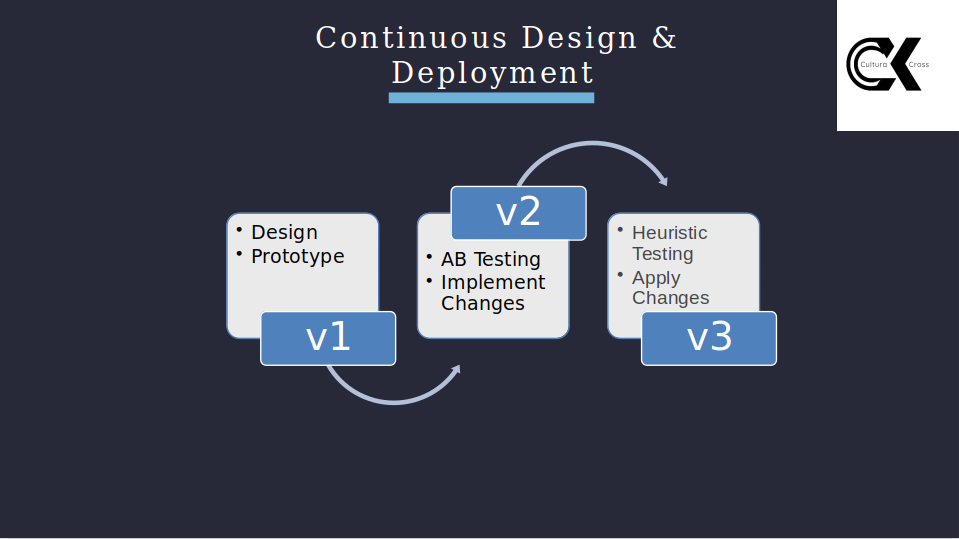
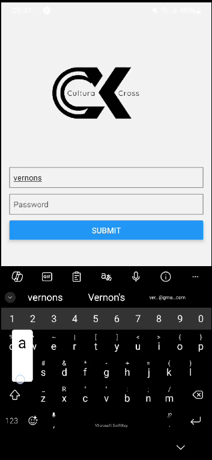
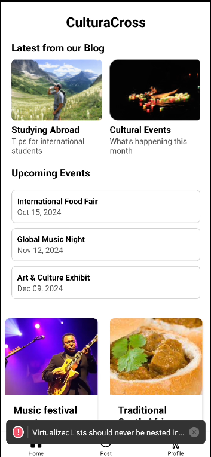
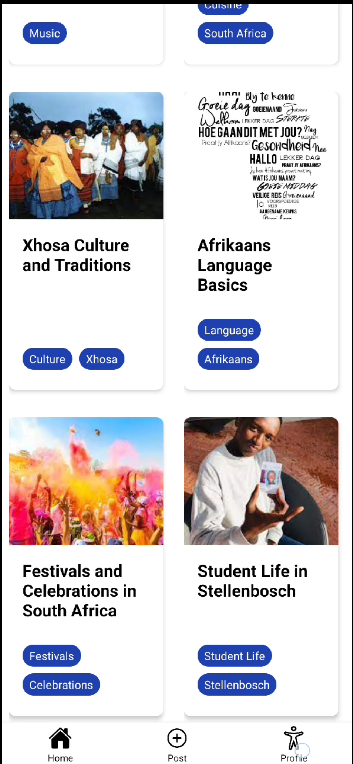
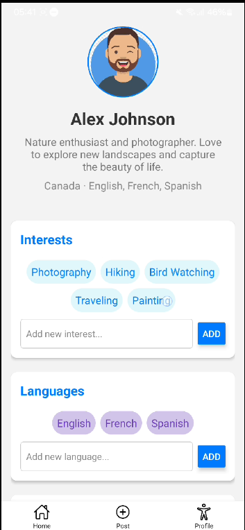
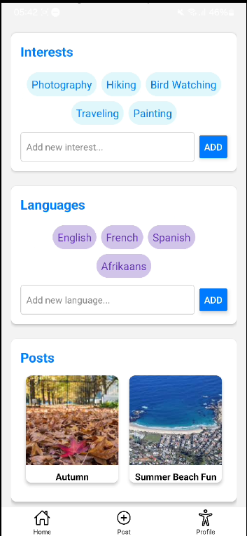
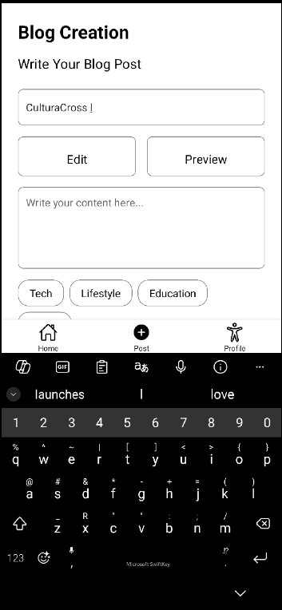

# CultraCross - A Cross-Cultural Blog Application

Welcome to the Cross-Cultural Blog Application! This project aims to foster cultural exchange among students by providing a platform where they can share their experiences, insights, and cultural narratives. Our goal is to enhance the sense of community and belonging among students from diverse backgrounds.

## Authors

- Vernon Stuurman
- Kaylan Naidu
- William Letshu

It was fun to work on this project with my friends. We didn't have enough time to complete the project so hopefully we can complete the project in the future.

## Design Overview

The project followed an interactive CI/CD design:

1. Initially, a project proposal was developed.
2. A mockup/low fidelity design of the project proposal was created.
3. This design was presented to a focus group of students for feedback.
4. The feedback was incorporated into the design, leading to a major change from an exclusively web application to a cellular application.
5. A high fidelity design of the application was then created.
6. This high fidelity design was shown to a new group of students to gain further input.
7. The feedback from this group was implemented, and the coding of the application began.
8. The final step was to roll out the application and have users test it on their devices.

## CI/CD



## Features

- **User-friendly Interface:** An intuitive design that makes it easy for students to create, edit, and view blog posts.
- **Cultural Exchange:** Students can share their unique cultural experiences and learn from others.
- **Community Building:** Encourages interaction and engagement among students from various cultural backgrounds.

## Get Started

1. **Install dependencies**

   ```bash
   npm install
   ```
2. **Run the app**

   ```
   npx expo start --tunnel
   ```

## User Interface

#### [User Login Page]()



#### [Blog Landing Page:]()





#### [User Profile Page:]()





#### [Post a Blog Page:]()



## License

*Stellenbosch University.*
